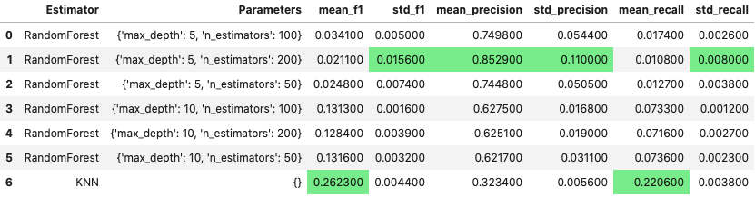

# sklearn-GridSearcher
An encapsulated class that can be used to grid-search different estimators and their parameters. Outputs grid-search results into pandas DataFrame.

Code is adapted from [here](http://www.davidsbatista.net/blog/2018/02/23/model_optimization/)


# Motivation
sklearn has a [GridSearch API](https://scikit-learn.org/stable/modules/generated/sklearn.model_selection.GridSearchCV.html) itself. However, it is limited in functionality. It only allows the user to perform gridsearch over parameters of ONE estimator. Often times, I want to gridsearch over multiple estimators.

# Example Usage
```python
models = {
    'RandomForest': RandomForestClassifier(),
    'KNN'         : KNeighborsClassifier(weights = "distance")
}

params = {
    'RandomForest': {
        'n_estimators': [100,200,50],
        'max_depth': [5, 10]
    },
    'KNN': {
        'n_neighbors': [1,3,5,10]
    }
}

scoring = {
    'f1':        make_scorer(f1_score, pos_label = 'bad'),
    'precision': make_scorer(precision_score, pos_label = 'bad'),
    'recall':    make_scorer(recall_score, pos_label = 'bad')
}
gs = GridSearchEstimators(models = models, params = params, scoring = scoring)
gs.fit(X_train, y_train)
gs.report()
```

# Example Output


